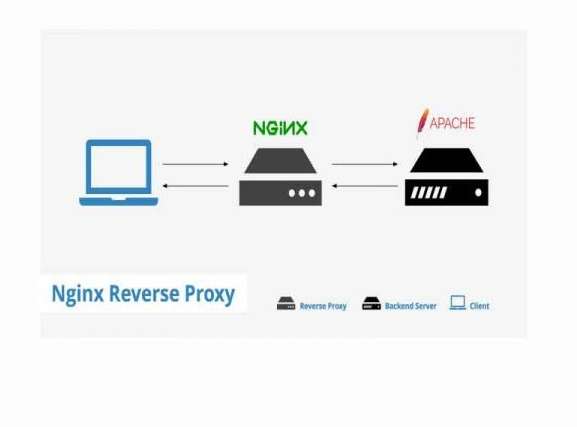

# I Nginx reverse-proxy apache  là gì ?
- Apache và Nginx là hai máy chủ web mã nguồn mở phổ biến thường được sử dụng với PHP. Cả Apache và Nginx đều có những ưu và nhược điểm khác nhau, tùy vào nhu cầu sử dụng mà ta có thể lựa chọn web server nào cho phù hợp. Tuy nhiên, ta hoàn toàn có thể tận dụng thế mạnh của cả Apache và Nginx bằng cách kết hợp chúng với nhau. Bài viết sau đây sẽ hướng dẫn các bạn làm cách nào để có thể kết hợn Nginx làm proxy cho Apache.
## Mô hình hoạt động

- Resverse Proxy : đứng trước server đến nhận các yêu cầu gửi đến từ người dùng gửi đến server giúp tăng tính bảo mật , giấu được địa chỉ ip của web server 
- 