# I SSL là gì ?
### SSL(Secure Sockets Layer). Là tiêu chuẩn của công nghệ bảo mật truyền thông mã hóa giữa máy chủ Web server và trình duyệt. Tiêu chuản này hoạt động và đảm bảo rằng các dữ liệu truyền tải giữa máy chủ và trình duyệt của người dùng đều riêng tư và toàn vẹn.
### TLS (Transport Layer Security)  là sự kế thừa của giao thức SSL để xác thực và mã hóa.
## Lợi ích khi sử dụng SSL:
- Xác thực website , giao dịch.
- Nâng cao hình ảnh, thương hiệu và uy tín doanh nghiệp.
- Bảo mật các giao dịch giữa khách hành và doanh nghiệp, các dịch vụ truy nhập hệ thống. 
- Bảo mật webmail và các ứng dụng như outlook web access, exchange, và Office Communication Server.
- Bảo mật các ứng dụng ảo hóa hoặc các ứng dụng điện toán đám mây.
- Bảo mật dịch vụ FTP.
- Bảo mật truy cập control panel.
- Bảo mật các dịch vụ truyền dữ liệu trong mạng nội bộ, file sharing, extranet.
- Bảo mật VPN Access Servers, Citrix Access Gateway …
- Website không được xác thực và bảo mật sẽ luôn ẩn chứa nguy cơ bị xâm nhập dữ liệu , dẫn đến hậu quả khách hàng không tin tưởng sử dụng dịch vụ.
## Các loại chứng chỉ SSL
- Domain Validation (DV SSL). Chứng thư số SSL chứng thực cho domain. Khi 1 web sử dụng DV SSL thì sẽ được xác thực tên domain, web đã được mã hóa an toàn khi trao đổi dữ liệu.
- Organization Validation (OV SSL). Chứng thư số SSL chứng thực cho website  và xác thực doanh nghiệp đang sở hữu web đó.
- Extended Validation (EV SSL)
. Cho khách hàng thấy web đang sử dụng chứng thư SSL có độ bảo mật cao nhất và được rà soát pháp lý kỹ càng.
- Wildcard SSL Certificate (Wildcard SSL) Sản phẩm lý tưởng cho các cổng thương mại điện tử. Mỗi e-store là một sub-domain và được chia sẻ trên 1 hay nhiều địa chỉ IP . Khi đó, để triển khai giải pháp bảo mật giao dịch trực tuyến( đặt hàng, thanh toán, đăng ký và đăng nhập tài khoản,...) bằng ssl , ta có thể dùng duy nhất 1 chứng chỉ số wildcard cho tên miền chính của website và tất cả sub-domain.

# II Cài SSL trên DirectAdmin

- Ta truy cập vào https://www.ssls.com/ để lấy chứng chỉ ssl.
- Ta đăng ký tài khoản.
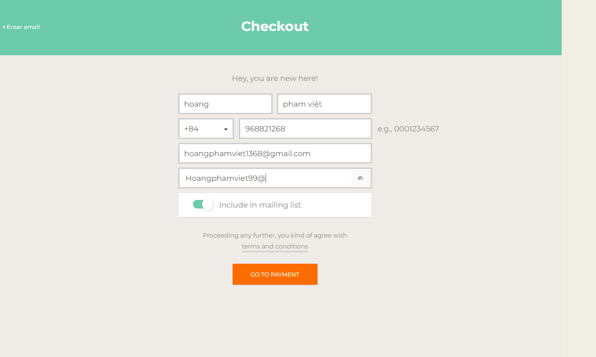
- Ta chọn activate để tiếp tục.
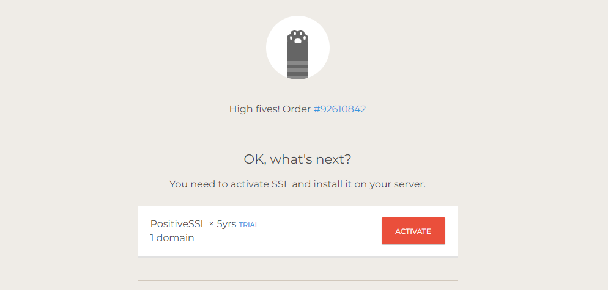
- Ta thêm tên miền 
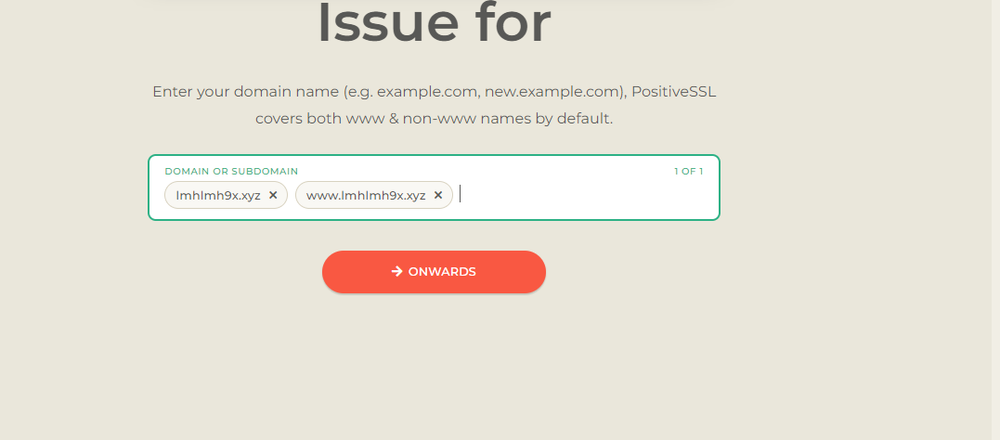
- Chọn khóa cá nhân tích chọn Use my CSR , ta copy câu lệnh
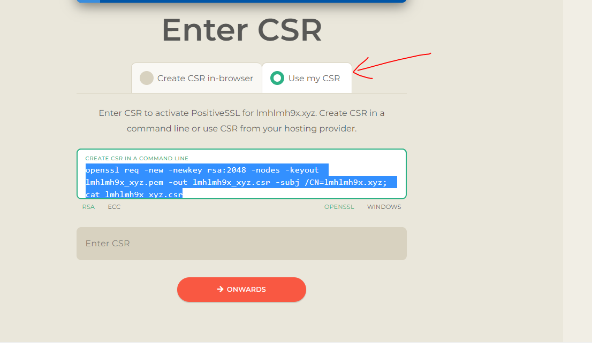 chạy để lấy key
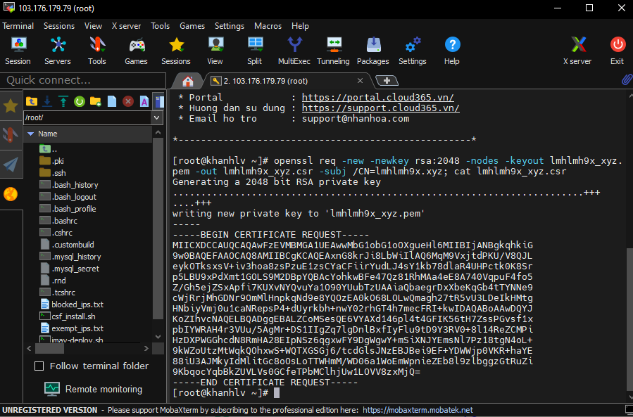 

- Sau khi lấy key ta copy Enter CSR
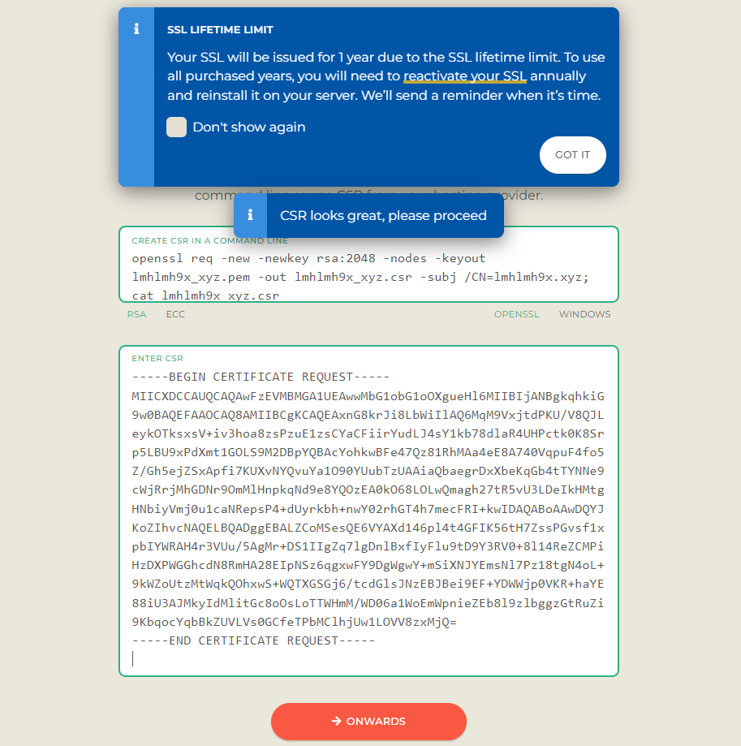 

- Tại đây ta xác định tên miền bằng bản ghi
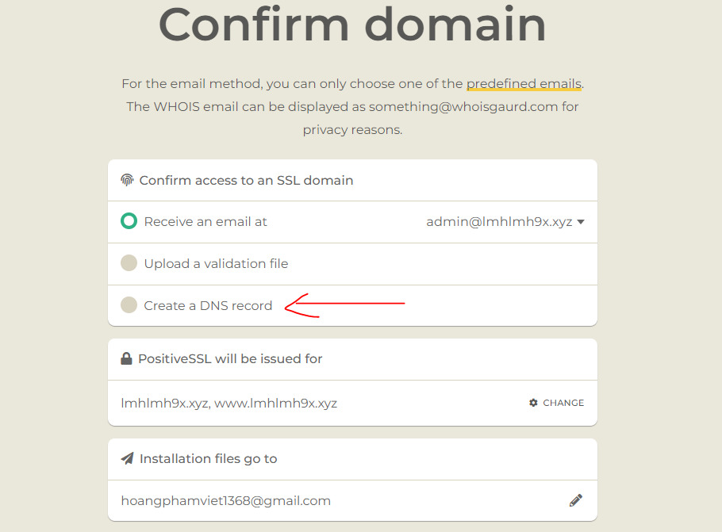 

- Ta sẽ tao 1 bản ghi cname cho tên miền theo ảnh
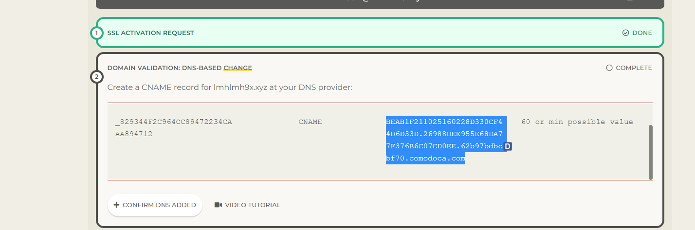 
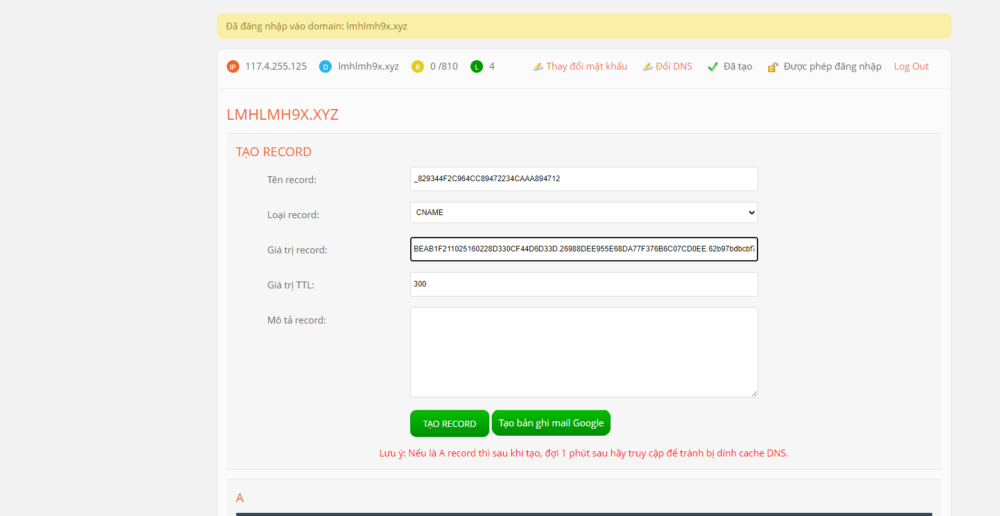

- Ta đợi xác thực và tải SSL xuống để tiến hành cài đặt.

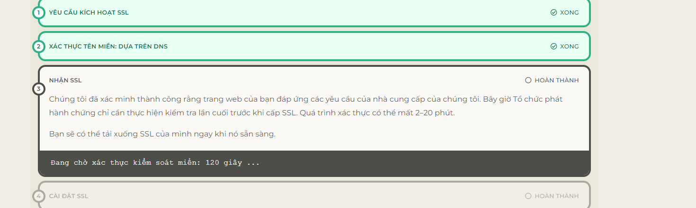 

- Tiến hành cài SSL thông qua DirectAdmin , ta đăng nhập và chọn SSL Certificates
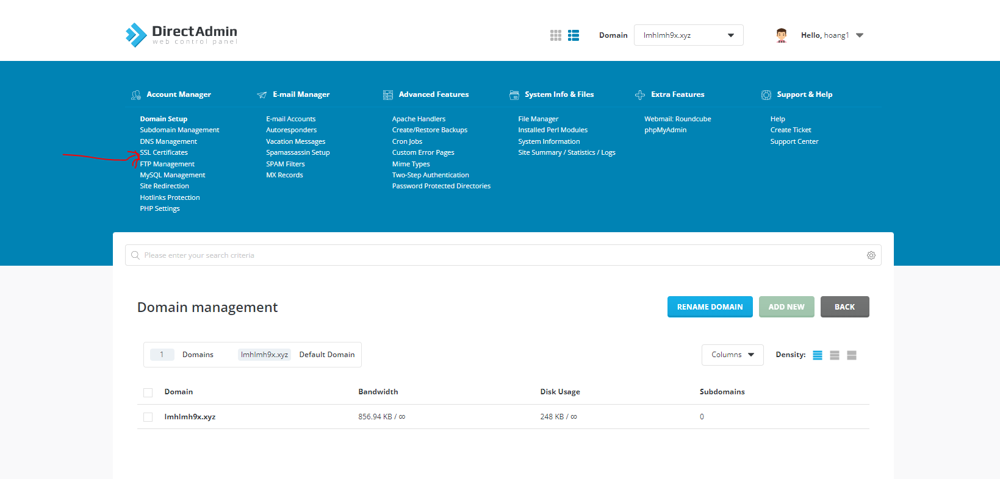 
- Ta chọn Paste a pre-generated certificate and key rồi điền key từ file tải về để cài ssl
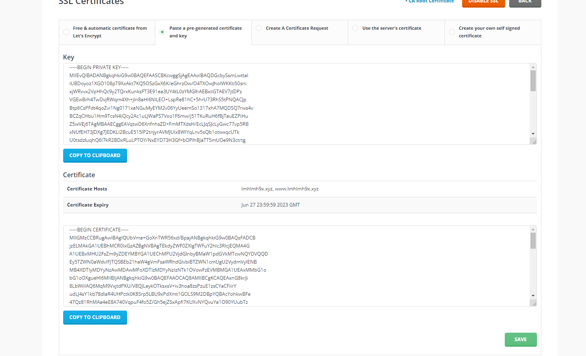 

- Ở mục  ta điền thông tin ở file vừa tải về và key.
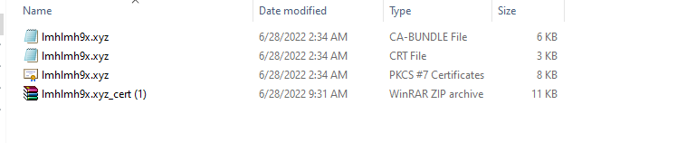 

- Sau đó ta lưu lại và tiến hành kiểm tra.
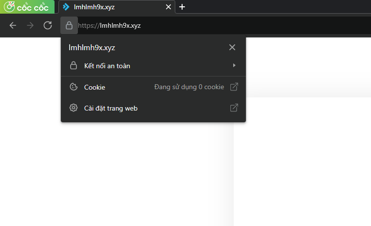 

