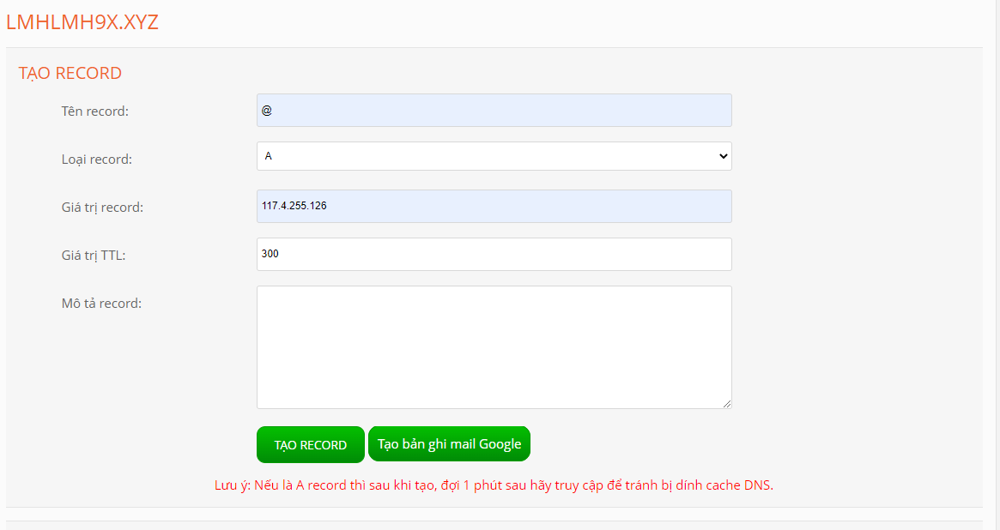
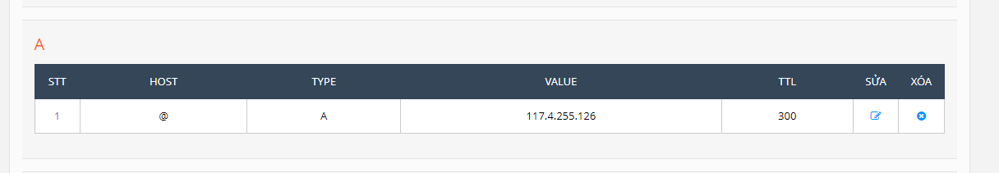
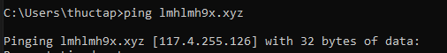
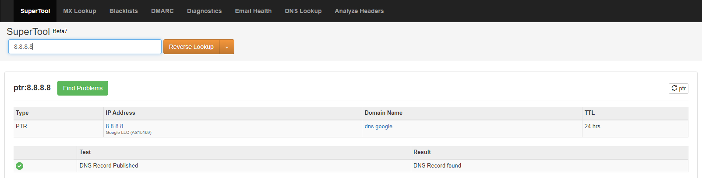
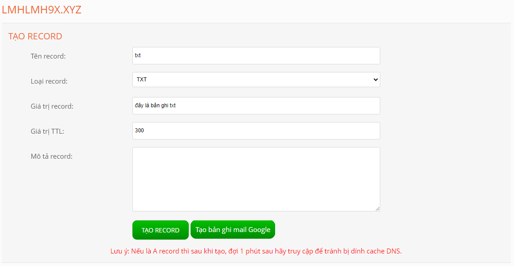
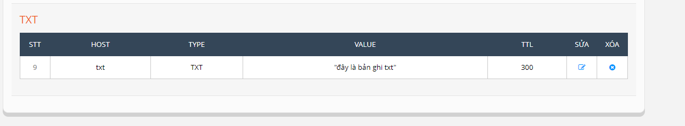

# I Các loại bản ghi phổ biến
+ 1.A record
+ Bản ghi này dùng để ánh xạ 1 tên miền với 1 địa chỉ IP, nó được xử dụng để trỏ tên miền về 1 địa chỉ IP xác định.
+ Cách tạo record A
+ Điền tên record , chọn loại record, điền giá trị record là địa chỉ IP ta muốn trỏ về tên miền về nó , giá trị TTL là thời gian tính bằng giây để mọi thay đổi đối với bản ghi DNS có hiệu lực.

 

 + Rồi ấn tạo record
 + Record A sau khi tạo thành công

 

 + Kiểm tra 

+ 2.AAAA record
+ nó tương tự như bản ghi A nhưng nó lưu trữ địa chỉ ipv6 thay vì ipv4 như bản ghi A

+ 3. PTR record
+ Bản ghi này giúp chuyển đổi từ địa chỉ IP sang tên miền , nó thường được sử dụng trong việc xác thực email gửi đi.

+ ta truy câp web mxtoolbox
chọn chế độ reverse lookup , nhập địa chỉ ip 8.8.8.8 bản ghi cho ra kết quả tên domain là google.com

+ 4. CNAME record
+ cho phép tên miền có nhiều bí danh khác nhau, khi truy cập các bí danh cũng về 1 địa chỉ tên miền.

+ 5. TXT record
+ bản ghi txt được sử dụng để cung cấp khả năng liên kết văn bản tùy ý với máy chủ. Chủ yếu dùng trong mục địch xác thực máy chủ với tên miền

+ 6. SRV record 
+ bản ghi được sử dụng để xác định vị trí các dịch vụ đặc biệt trong domain, vd tên máy chủ , số cổng của các máy chủ cho các dịch vụ được chỉ định.
+ các trường trong bản ghi này gồm:
+ tên dịch vụ service
+ giao thức sử dụng
+ tên miền
+ TTL :  thời gian tính bằng giây để mọi thay đổi đối với bản ghi DNS có hiệu lực.
+ class: standard DNS class, luôn là IN
+ ưu tiên: ưu tiên của host , số càng nhỏ càng ưu tiên
+ trọng lượng: khi cùng bực ưu tiên, thì trọng lượng 3 so với trọng lượng 2 sẽ được lựa chọn 60% (hỗ trợ load balancing).
+ Port của dịch vụ (tcp hay udp). Target chỉ định FQDN cho host hỗ trợ dịch vụ.
+ 7. MX record
+ Bản ghi MX có tác dụng xác định, chuyển thư đến domain hoặc subdomain đích. 
+ Bản ghi MX không nhất thiết phải trỏ đến hosting – VPS- Server của người dùng
+ Nếu người dùng đang sử dụng dịch vụ mail của bên thứ ba như Gmail thì cần sử dụng bản ghi MX do họ cung cấp.
+ 8. SPF Record
+ cách xác minh xem thư được gửi từ 1 mail server có đến từ 1 domain name xác thực.Nó sẽ tiến hành truy vấn xem địa chỉ IP đó có nằm trong danh sách IP hợp lệ để gửi mail hay không. Nếu không email sẽ chuyển đến hộp spam.
+ khi có email tới hệ thống người nhận sẽ tiến hành xác thực xem địa chỉ gửi có phù hợp không, ip người gửi có nằm trong danh sách ip được cấp phép không, từ đó sẽ quyết định xem chấp nhận hoặc từ chối.
+ 9. Record DKIM
+ Là bản ghi dùng để xác thực người gửi bằng cách mã hóa một phần email gửi bằng một chuỗi ký tự, xem như là chữ ký.
+ 10. DMARC record
+ DMARC là giao thức nâng cấp kết hợp của DKIM và SPF từ đó giúp người dùng có thể cài đặt các chính sách để loại bỏ hoặc đưa nó vào spam từ nguồn mail không có độ tin cậy.
+ DMARC record là những chính sách quan trọng đòi hỏi thực hiện 1 cách chính xác, nhằm mục đích tạo ra 1 bộ lọc hoàn hảo để sàng lọc các email.

 

 

