# I Tường lửa là gì ?
1. Tường lửa là gì 
- Tường lửa là  một thiết bị bảo mật giám sát lưu lượng mạng. Nó bảo vệ mạng nội bộ bằng cách lọc lưu lượng đến  và đi dựa trên một tập hợp cá quy tắc đã thiết lập. Thiết lập tường lửa là cách thêm 1 lớp bảo mật giữa hệ thống và các cuộc tấn công độc hại.
2. Phân loại :
- Firewall được chia làm 2 loại gồm firewall cứng và firewall mềm
- 2.1 Firewall cứng là những firewall được tích hợp trên router
- đặc điểm:
- không linh hoạt như firewall mềm : không thể thêm chức năng , thêm quy tắc như firewall mềm.
- nó hoạt động ở tầng thấp hơn firewall mềm
- firewall cứng không thể kiểm tra nội dung của 1 gói tin.
- 2.2 firewall mềm là những firewall được cài đặt trên server
- đặc điểm:
- tính linh hoạt cao: có thể thêm , bớt các quy tắc, các chức năng.
- firewall mềm hoạt động ở tầng cao hơn cứng
- nó có thể kiểm tra được nội dung của các gói tin

## II Cài đặt 1 số loại tường lửa
 1. tìm hiểu về CSF
CSF là 1 gói ứng dụng hoạt động trên linux như 1 firewall được phát hành miễn phí để tăng tính bảo mật cho server. Nó dựa trên iptables và tiến trình ldf đề quét các file log để phát hiện các dấu hiệu tấn công bất thường.
- tác dụng:
 + chống dos các loại
 + chống scan port
 + đưa ra các lời khuyên về cấu hình server 
 + chống BruteForce Attack vào ftp server, web server, mail server,directadmin,cPanel…
 + chống syn flood
 + chống ping flood
 + cho phép ngăn chặn truy cập từ 1 quốc gia nào đó bằng cách chỉ định Country Code chuẫn ISO
 + hỗ trợ ipv4 , ipv6
 + cho phép khóa ip tạm thời và vĩnh viễn ở tầng mạng (An toàn hơn ở tầng ứng dụng ) nên webserver ko phải mệt nhọc xử lý yêu cầu từ các IP bị cấm nữa
 + Cho phép bạn chuyến hướng yêu cầu từ các IP bị khóa sang 1 file html để thông báo cho người dùng biết IP của họ bị khóa
 
 2. Cài đặt
 - Cài đặt Dependencies
  + yum -y install wget perl unzip net-tools perl-libwww-perl perl-LWP-Protocol-https perl-GDGraph -y

 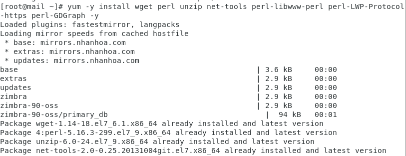
 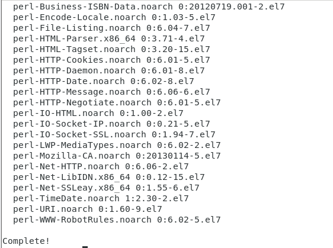

- Tải CSF: tải csf vào thư mục /tmp của server bằng lệnh wget , giải nén file bằng lệnh tar và  install CSF bằng cách chạy script ./install.sh.
+ cd /tmp

 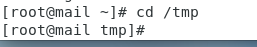

+ wget https://download.configserver.com/csf.tgz

 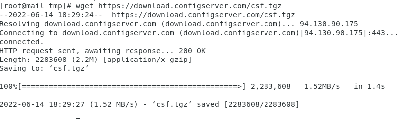

+ tar -zxvf csf.tgz

 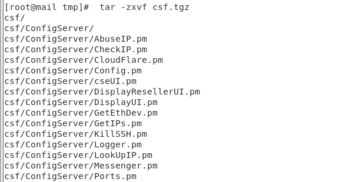

+ cd csf

 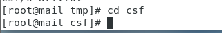

+ ./install.sh

 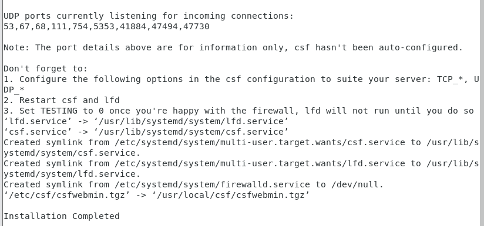

- tắt firewalld trên centos 7
+ trước khi config , trên centos có 1 ứng dụng tường lửa mặc định là firewalld cần tắt và xóa nói khỏi startup 
+ systemctl stop firewalld
+ systemctl disable firewalld
+ sau đó ta kiểm tra trạng thái hoạt động bằng lệnh systemctl status firewalld

 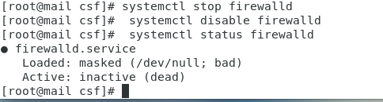

- Cấu hình CSF
+ nano /etc/csf/csf.conf
- 1 số thông số cấu hình trong file csf.conf:
+ 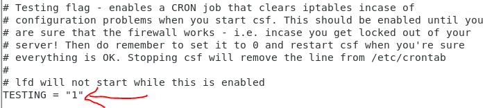
+ mặc định vừa cài TESTING = "1" với giá trị đó thì Login Fail Detect daemon sẽ không hoạt động, do đó nếu cso sai sót thì server cũng sẽ không chặn ip của bạn.
+ 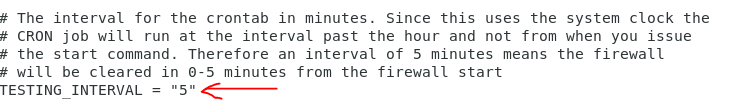
+ thời gian chạy cropjob để clear iptables nếu như testing = 1, tính bằng phút
 + 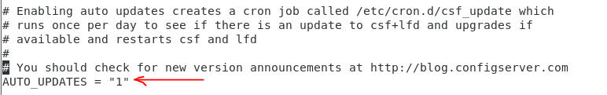
 + AUTO_UPDATES =“1” là cập nhập tự động nếu muốn tắt cập nhập tự động chuyển thành 0.
+ 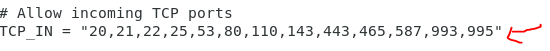
+ Mở các cổng cho phép nhận gói tin từ bên ngoài
+ 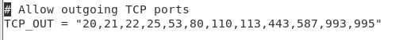
+ Mở các cổng cho phép gửi gói tin ra bên ngoài
+ 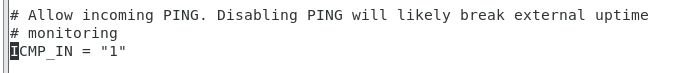
+ cho phép người dùng ping đến server, nếu không muốn người dùng pìn ta đổi giá trị 1 về 0
+ 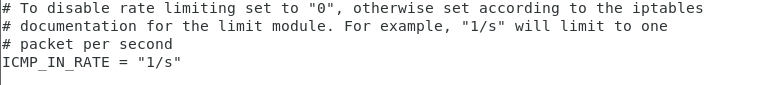
+ ICMP_IN_RATE = “1/s" thông số này sẽ giới hạn tần số ping đến server là 1/s. Nếu ping nhanh hơn tốc độ này sẽ nhận được "request timeout".
+ 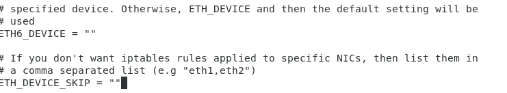
+ mặc định csf sẽ cấu hình iptables để filter traffic trên toàn bộ các card mạng, ngoại trừ card loopback . Nếu như muốn rules iptables chỉ applied vào card mạng "eth0" thì ta khai báo
+ ETH_DEVICE_SKIP = " "  nếu không muốn rules iptables không applied vào card mạng nào thì khai báo ở đây.
+ 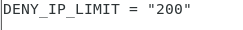
+ DENY_IP_LIMIT = "200"
+ Giới hạn số lượng ip bị chặn bởi csf( các ip này được lưu trong file /etc/csf/csf.deny). Khi số lương ip bị chặn vượt quá số này, csf sẽ tự bỏ chặn ip cũ nhất (ip ở dòng đầu tiên của file /etc/csf/csf.deny)
+ 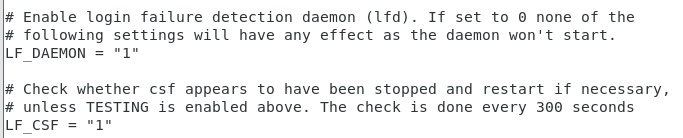
+ LF_DAEMON = "1" cho phép tính năng Login fail detection
+ LF_CSF = "1" tự động restart csf khi csf bị stop.

- Một số lệnh CSF
 + csf -s : chạy firewall
 + csf -f : dừng - Flush firewall
 + csf -r : nạp lại CSF (sau khi thay đổi cấu hình, thiết lập)
 + csf -d : cấm 1 ip truy cập
 + csf -df: gỡ 1 ip ra khỏi danh sách chặn.
 - vd chặn 1 địa chỉ ip : 
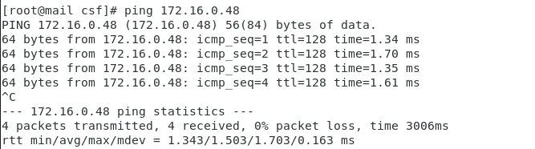

+ ta thấy ping giữa máy ảo với máy thật vẫn được
+ ta sẽ dùng lệnh csf -d cấm ip 
+ csf -d 172.16.0.48 
+ sau đó ta kiểm tra lại sẽ thấy không còn ping đến địa chỉ ip đó nữa
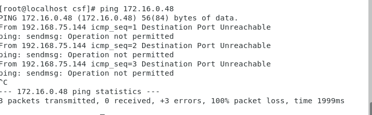

+ để bỏ chặn ip ta dùng lệnh csf -df
+ csf -df 172.16.0.48
+ sau đó ta kiểm tra lại
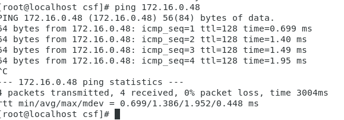

  
