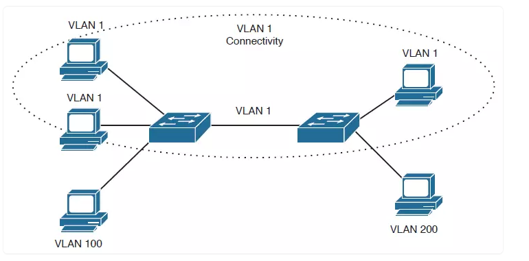

# I Tìm hiểu về VLAN
- 1.1 Vlan là gì?
VLAN (Virtual Local Area Network) là một mạng tùy chỉnh, được tạo từ một hay nhiều mạng cục bộ khác (LAN). Mạng VLAN cho phép một nhóm thiết bị khả dụng trong nhiều mạng được kết hợp với nhau thành một mạng logic. Từ đó tạo ra một mạng LAN ảo (Virtual LAN), được quản lý giống như một mạng LAN vật lý.
- 1.2 Cách thức hoạt động của Vlan:
 + Các Vlan ở trong mạng được xác định bằng 1 con số cụ thể.
 + Phạm vi giá trị hợp lệ là 1 - 4096. Trên một switch Vlan , ta có thể chỉ định các cổng với số Vlan thích hợp.
 + Switch sẽ cho phép dữ liệu cần được gửi giữa các port khác nhau có cùng một vlan.
 + Hầu hết các mạng đều có nhiều hơn là chỉ 1 switch trong mạng. Cách đơn giản nhất là gán một port trên mỗi switch của vlan và chạy một cable giữa chúng.
 - 1.3 Ứng dụng của vlan:

 
  
  + Đối với những mạng Lan có quy mô lớn, khoảng 200 thiết bị trở lên, thì việc sử dụng mạng Vlan đem lại lớn ích lớn.
  + Lý tưởng cho những mạng có lưu lượng truy cập cao
  + Hữu ích cho nhóm người dùng cần bảo mật cao, hoặc không thích mạng bị chậm do số lượng  broadcast lớn.
  + Ứng dụng khi mạng có nhiều người sử dùng, nhưng lại không ở trên cùng một broadcast domain
  + Có thể biến một switch đơn nhất thành nhiều switch.
