# I Tìm hiểu về vmware
- 1.1 Vmware là gì?
- Vmware Server là phần mềm ảo hóa máy chủ miễn phí. Công cụ này cho phép bạn sử dụng nhiều máy ảo trên một máy chủ vật lý. Bên cạnh đó, Vmware Server cũng tương thích với Windows, Linux, Solaris,..
- 1.2 VMware Server hoạt động như thế nào?
- VMware server cài đặt và chạy như một ứng dụng on top của hệ điều hành Windows hoặc Linux. Virtualization layer sẽ phân vùng máy chủ vật lý sao cho nhiều máy ảo có thể chạy đồng thời trên một máy chủ đơn.
- Tài nguyên máy tính của máy chủ vật lý được coi là một nhóm tài nguyên thống nhất có thể được phân bổ cho virtual machines theo cách được kiểm soát.
- VMware Server tách riêng từng máy ảo khỏi máy chủ của nó và các máy ảo khác, để máy này không bị ảnh hưởng nếu có máy khác bị treo. Dữ liệu không bị rò rỉ trên máy ảo và ứng dụng chỉ có thể giao tiếp thông qua các kết nối mạng được cấu hình. VMware Server đóng gói môi trường máy ảo như một tập hợp các tệp, giúp dễ sao lưu, di chuyển và sao chép.

- 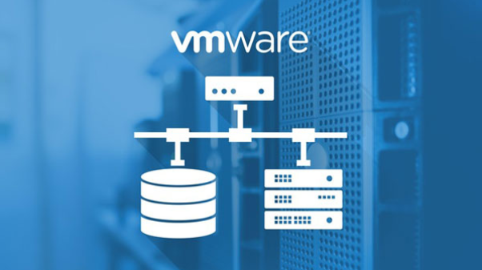
## II Cài đặt 1 số máy ảo trên vmware
- 1 Centos 7
- Bước 1 : Khởi động vmware
- Bước 2 : Tạo 1 máy ảo 
- 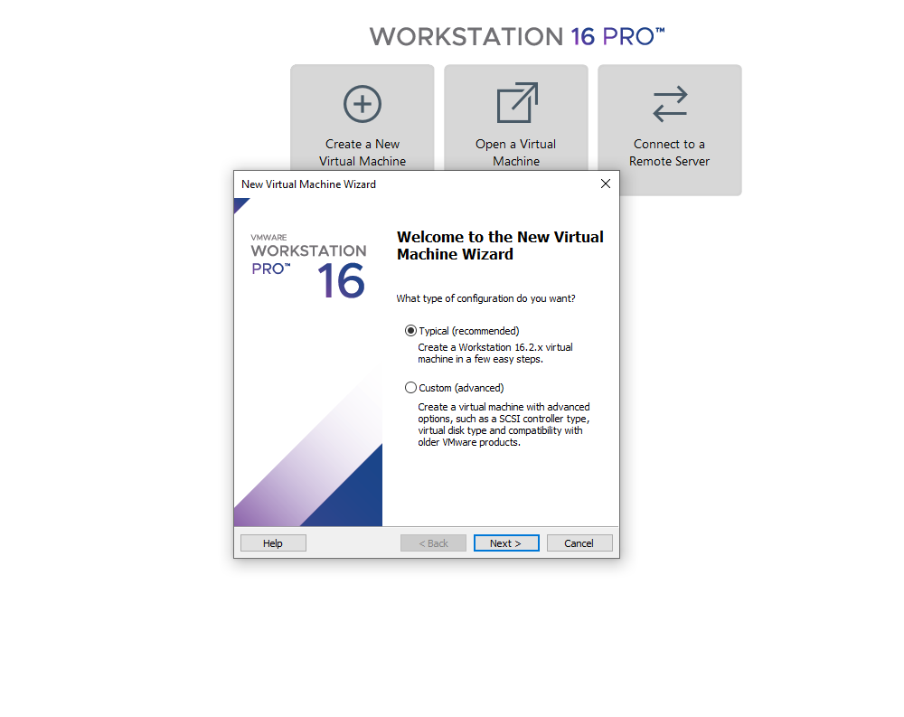
- Bước 3 : Chọn đường dẫn đến file iso centos 7
- 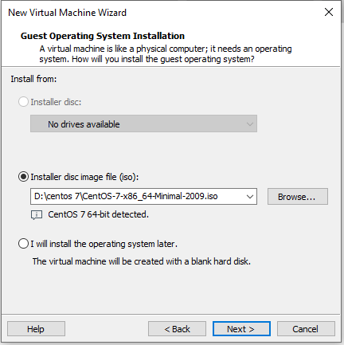
- Bước 4 : Đặt tên cho máy ảo và chọn nơi lưu
- 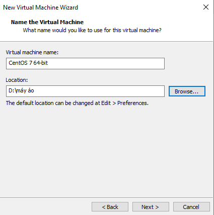
- Bước 5 : Chọn kích thước ổ đĩa cho máy ảo
- 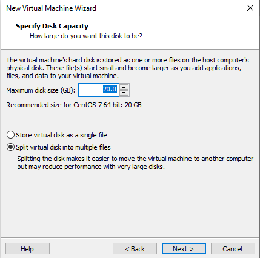
- Bước 6 : Chọn cấu hình cho các phần cứng
- 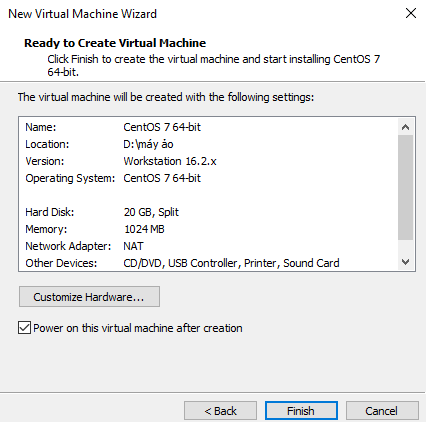
- Bước 7 : Chờ máy ảo khởi động
- 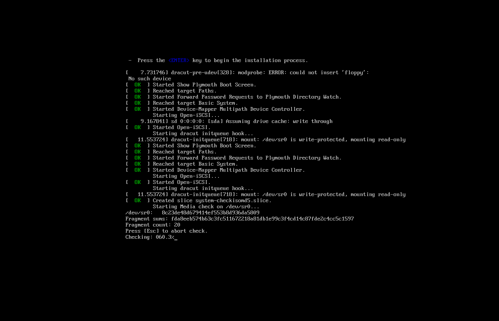
- Bước 8 : Chọn ngôn ngữ
- 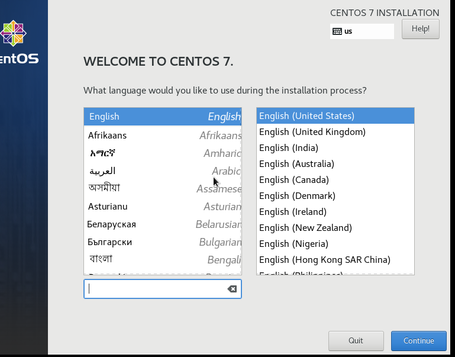
- Bước 9 : Cài đặt ngày giờ
- 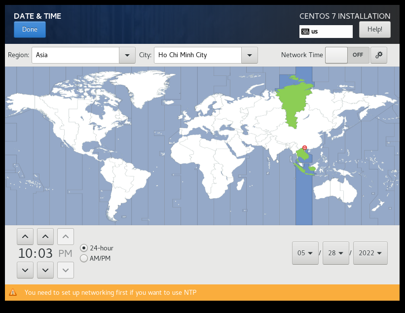
- Bước 10 : Lựa chọn ổ đĩa
- 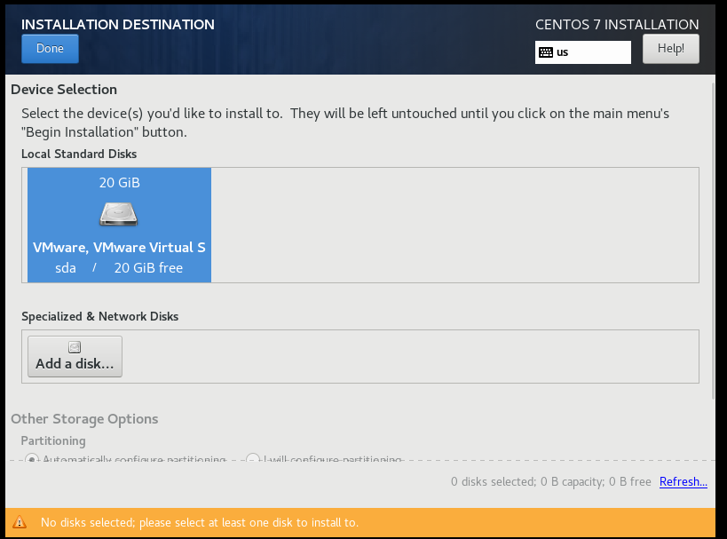
- Bước 11 : Cài đặt mật khẩu root
- 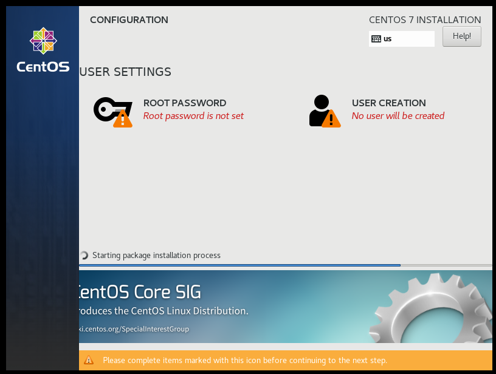
- Bước 12 : Chờ máy cài đặt
- 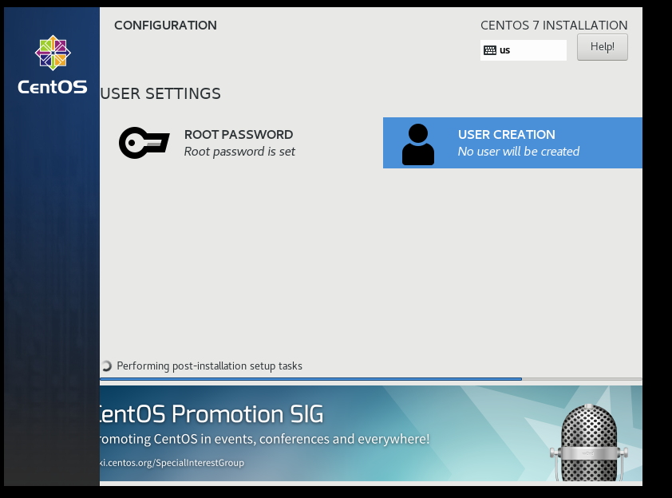
- Giao diện sau khi cài đặt hoàn tất
- 
- Kiểm tra phiên bản của hệ điều hành 
- 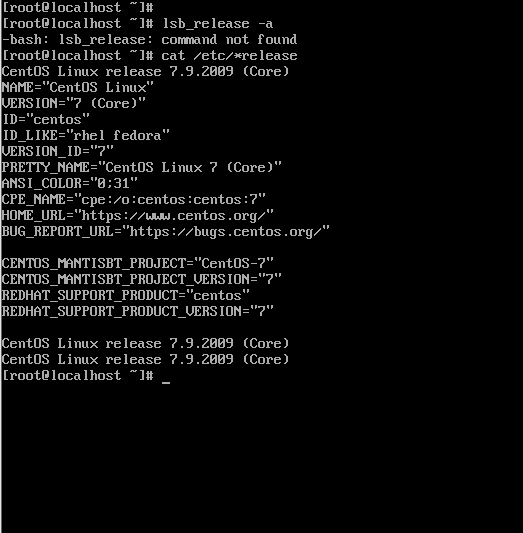
- 2 windows server 2012
- Bước 1 : Khởi động vmware
- Bước 2 : Tạo 1 máy ảo 
- 
- Bước 3 : Chọn đường dẫn đến file iso win 2012
- 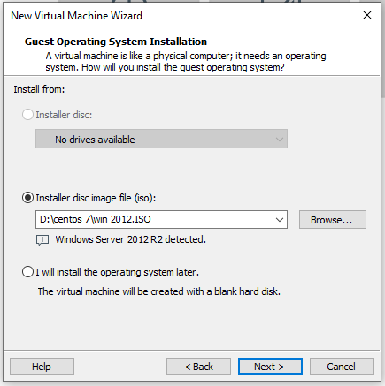
- Bước 4 : Đặt tên cho máy ảo và chọn nơi lưu
- 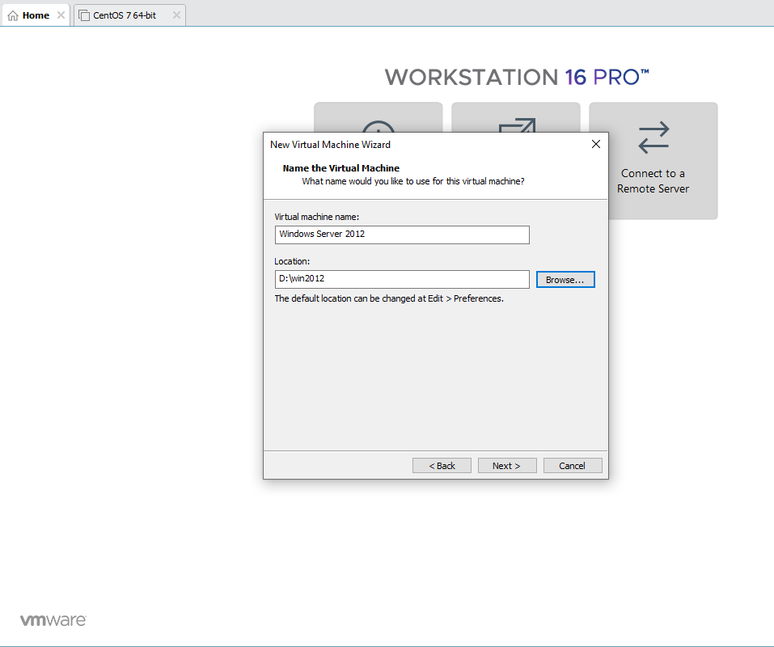
- Bước 5 : Chọn kích thước ổ đĩa cho máy ảo
- 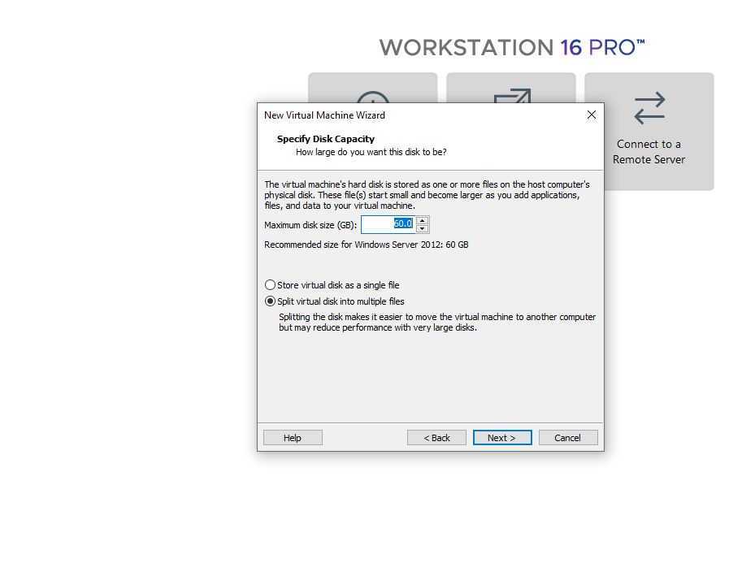
- Bước 6 : Chọn cấu hình cho các phần cứng
- 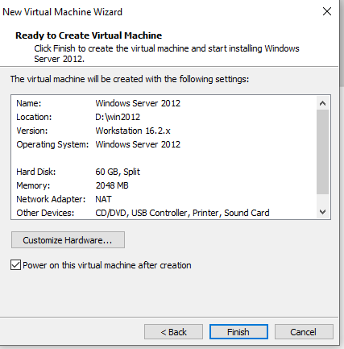
- Bước 7 : Lựa chọn ngôn ngữ
- 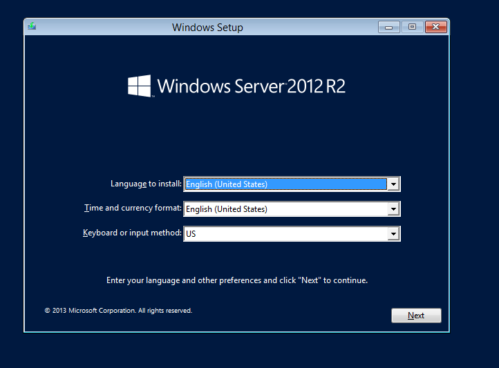
- Bước 8 : Lựa chọn phiên bản
- 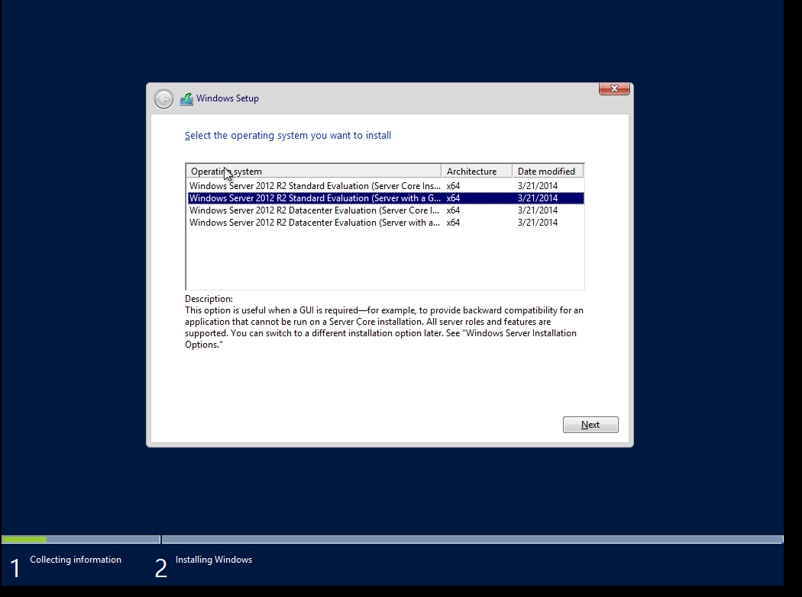
- Bước 9 : chờ máy cài đặt
- 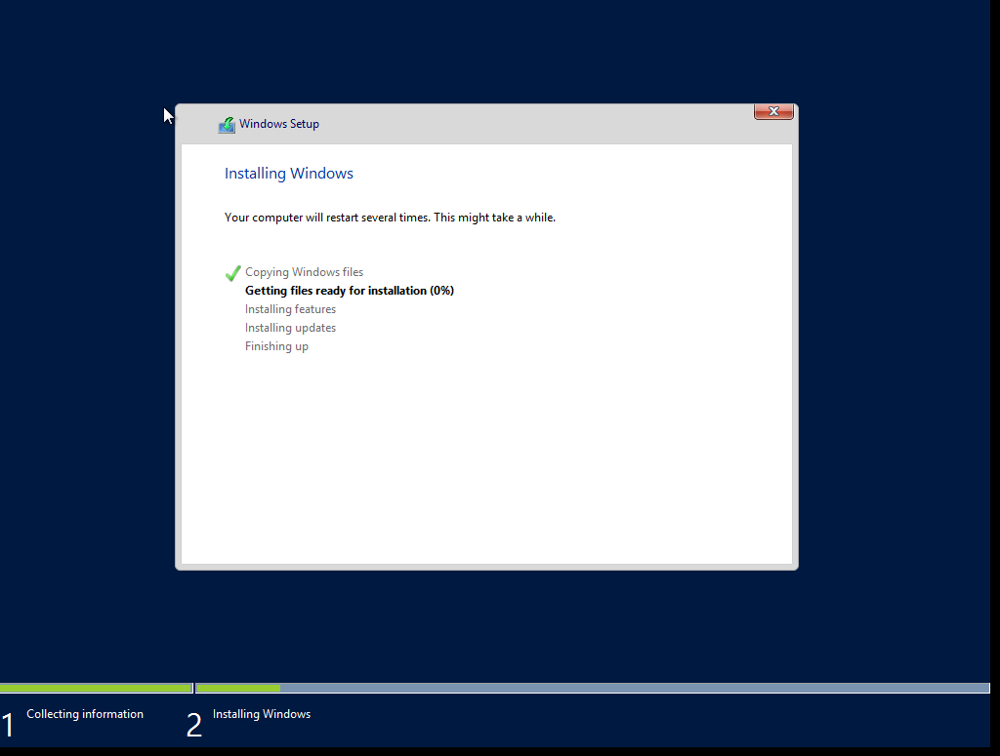
- Bước 10 : cài đặt mật khẩu
- 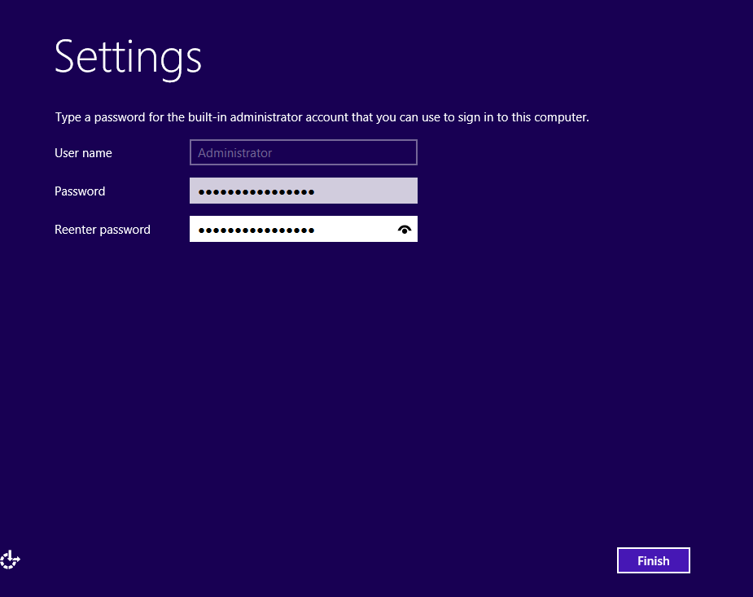
- Bước 11 : giao diện khi cài đặt hoàn tất
- 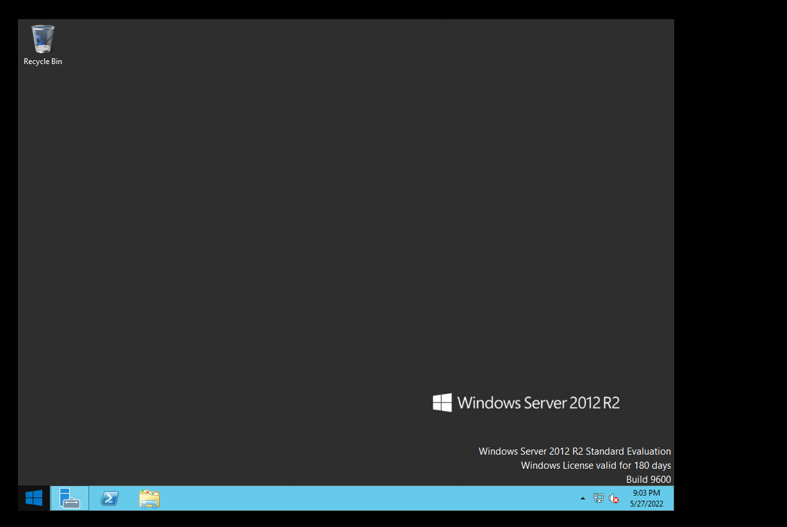

