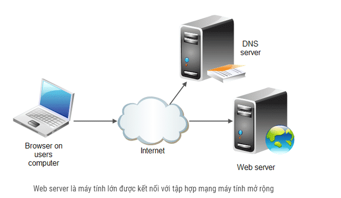
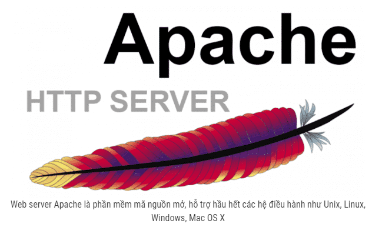
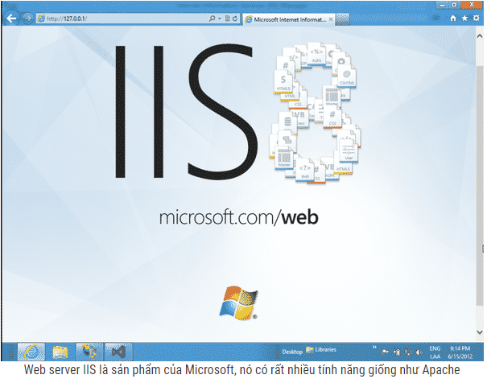
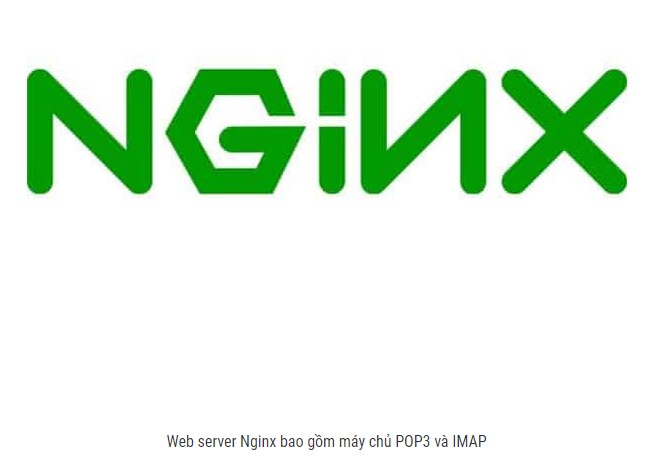

# I Tìm hiểu về Web server ?
## 1 Web server là gì ?
Web server có nghĩa là máy chủ web, là máy tính lớn được kết nối với tập hợp mạng máy tính mở rộng. Máy chủ chứa toàn bộ dữ liệu mà nó được giao quyền quản lý. Mỗi máy chủ có một IP riêng và có thể đọc đa dạng ngôn ngữ như HTML, HTM, File,… Máy chủ có dung lượng lớn và tốc độ rất cao để có thể lưu trữ và vận hành tốt kho dữ liệu trên internet. Thông qua cổng giao tiếp riêng biệt của mỗi máy chủ mà hệ thống máy tính có khả năng hoạt động trơn tru hơn. Máy chủ phải đảm bảo hoạt động liên tục để có thể cung cấp dữ liệu cho mạng lưới máy tính của nó.

- Web server có thể là phần cứng hoặc phần mềm cũng có thể bao gồm cả hai. 

- Phần cứng: Máy chủ web là một máy tính lưu trữ các file ảnh, tài liệu HTML, CSS, file JavaScript của một website và chuyển chúng tới thiết bị của End-user. Máy chủ được kết nối internet và truy cập thông qua một tên miền như Mozilla.org.
- Phần mềm: Web server gồm một số phần điều khiển người dùng truy cập đến file lưu trữ trên một máy chủ HTTP. Máy chủ HTTP là một phần mềm, nó có khả năng hiểu được các địa chỉ website (URL) và giao thức trình duyệt sử dụng để xem các website (HTTP).
- Bất cứ khi nào một trình duyệt cần đến file được lưu trữ trên máy chủ, trình duyệt gửi yêu cầu file đó thông qua HTTP. Khi yêu cầu tới đúng máy chủ (phần cứng), HTTP (phần mềm) sẽ gửi tài liệu được yêu cầu trở lại thông qua HTTP.
## 2. Các đặc tính của Web server
- Web server (máy chủ web) có thể xử lý dữ liệu, cung cấp thông tin đến máy khách qua môi trường internet thông qua giao thức HTTP, giao thức được thiết kế gửi file đến trình duyệt web hay giao thức khác.
- Nếu được cài đặt một chương trình Server Software và kết nối internet thì bất cứ máy tính này cũng có thể trở thành web server. Phần mềm Server Software là phần mềm chuyên dụng để cài đặt và chạy trên bất cứ máy tính nào có thể đáp ứng đủ yêu cầu về bộ nhớ. Nhờ có nó mà người dùng có thể truy cập đến các thông tin của website từ một máy tính khác qua internet.
- Người ta thường thuê các máy chủ nhỏ, máy chủ ảo VPS hay Hosting để lưu trữ dữ liệu cho website của mình.
- Một server có thể cung cấp cả nội dung Static và Dynamic. Static có nghĩa là nội dung nguyên vẹn và dễ dàng để thiết lập. Dynamic là nội dung đã được sever xử lý hoặc tạo mới với dữ liệu từ Database, định dạng, đẩy vào trong HTTP Template rồi gửi kết quả đến người dùng.  
## 3. Các bước lấy dữ liệu của một website

- Bước 1 : Web server lưu trữ các file của web - hosting file 

- Web server lưu trữ các file của website (bao gồm các tài liệu HTML, ảnh file CSS, fonts, video, file JavaScript). Người dùng hoàn toàn có thể lưu trữ chúng trên máy tính của mình nhưng khi lưu trên máy chủ web sẽ có những lợi ích sau:

+ Luôn sẵn sàng – up and running
+ Luôn kết nối tới mạng internet
+ Địa chỉ IP cố định
+ Được bảo dưỡng và bảo vệ bởi nhà cung cấp
- Bước 2 : Web server sẽ hỗ trợ giao thức truyền phát siêu văn bản – HTTP. HTTP là tập hợp các quy tắc kết nối giữa hai máy tính bao gồm Textual và Stateless.

- Textual: Mọi lệnh đều là văn bản thuần túy và người dùng có thể đọc được nó.
- Stateless: Khi cả người dùng và máy chủ không nhớ kết nối trước đó.
- HTTP có quy tắc rõ ràng về giao tiếp giữa client và server như sau:

+ Duy nhất client có thể tạo ra yêu cầu HTTP đến server. Các server chỉ có thể đáp trả yêu cầu HTTP của client.
+ Client phải cung cấp URL của file khi yêu cầu file đó thông qua HTTP.
+ Tất cả yêu cầu HTTP sẽ được web server trả lời.
- HTTP có trách nhiệm xử lý và trả lời các yêu cầu đến qua các bước:

+ Khi nhận được một yêu cầu, HTTP sẽ kiểm tra URL được yêu cầu có khớp với file hiện có không?
+ Nếu trùng khớp, máy chủ web sẽ gửi nội dung file trả lại trình duyệt. Trường hợp không trùng khớp, một Application server sẽ tạo ra file được yêu cầu.
+ Web server sẽ gửi trả lại một thông điệp lỗi cho trình duyệt (phổ biến nhất là 404 Not Found) nếu nó không thể xử lý được.

## 4 Các loại Web server phổ biến
- 1 Web server Apache
- Web server Apache được phát triển bởi Quỹ Phần mềm Apache và là một trong những web server nổi tiếng trên thế giới. Đây là phần mềm mã nguồn mở, hỗ trợ hầu hết các hệ điều hành như Unix, Linux, Windows, Mac OS X, FreeBSD,… Theo thống kê, khoảng 60% máy tính chạy trên web server Apache.

- 2 Web server IIS
- Web server IIS là sản phẩm của Microsoft, nó có rất nhiều tính năng giống như Apache. Tuy nhiên, đây không phải là mã nguồn mở và việc thêm, chỉnh sửa các Module theo ý muốn không hề dễ dàng. Web server IIS có khả năng chạy trên tất cả nền tảng của hệ điều hành của Windows.

- 3 Web server Nginx
- Web server Nginx là một máy chủ mã nguồn mở miễn phí. Nginx bao gồm máy chủ POP3 và IMAP. Web server Nginx có ưu điểm là ổn định, hiệu suất cao, cấu hình đơn giản và sử dụng tài nguyên thấp. Nginx không dùng các chuỗi (thread) để xử lý các yêu cầu mà sử dụng kiến trúc lập trình theo sự kiện (có khả năng mở rộng). Kiến trúc lập trình này dùng bộ nhớ khi tải nhỏ và dự đoán được. Nginx hiện đang lưu trữ khoảng 7.5 % các tên miền trên toàn thế giới. Trong những năm trở lại đây, phần đông công ty web hosting sử dụng Nginx.

