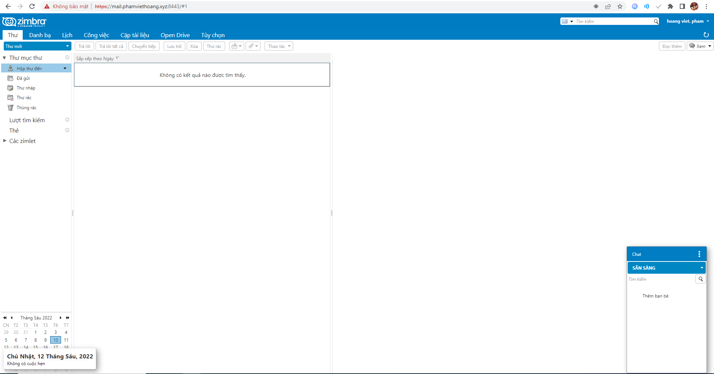

# I Tìm hiểu về zimbra
1. Zimbra là gì ?
- Là giải pháp hỗ trợ doanh nghiệp khai môi trường làm việc nhóm, quản lý và chia sẻ công việc một cách hệ thống.
- Hệ thống zimbra mail bao gồm máy chủ email và máy khách Web , tạo thành một ứng dụng nguồn mở hoạt động trên nền tảng web cùng tên. Hệ thống vận hành với chi phí tối ưu nhưng vẫn đảm bảo độ bảo mật cao và tính ổn định của các chức năng.
- Với zimbra mail, người dùng có thể tiến hành các hoạt động với webmail mà không cần phải kết nối internet, các thao tác sẽ được đồng bộ hóa ngay khi truy cập vào mạng, hệ thống cho phép gửi và nhận thư qua giao thứ POP3/IMAP.
2. Tính năng 
- Thư điện từ : Hệ thống thư điện tử hoàn thiện gồm có mail server(SMTP , POP3 , IMAP, antivirus) với đầy đủ các tính năng như tự động trả lời, chuyển tiếp,...) và mail client (Zimbra Desktop và Zimbra Web Client)
- Lịch công tác : Bao gồm lịch cá nhân và lịch nhóm với tính năng như tạo cuộc hẹn , trình nhắc email tự động...
- Danh bạ : quản lý số địa chỉ, thông tin cá nhân, nhóm,...
- Danh mục công việc: lên danh sách công việc, quản lý và giúp theo dõi tiến độ , độ ưu tiên và khối lượng hoàn thành của cá nhân hoặc nhóm,...
- Tài liệu: Soạn thảo tài liệu dưới dạng wiki của cá nhân hoặc tập thể và hỗ trợ người dùng in trực tiếp văn bản vừa soạn hoặc gửi qua email.
- Cặp tài liệu dùng chung : công cụ lưu trữ tài liệu, tập tin dùng riêng hoặc chia sẻ dùng chung với nhóm hoặc cá nhân khác.
- Chat : Liên lạc nội dung trong mạng Lan hoặc trên internet.
- Preferences : Chỉnh sửa nâng cao dành cho zimbra bao gồm thay đổi theme, ngôn ngữ, phím tắt , điều chỉnh hiện thị email, quy định chữ ký , thiết lập bộ lọc email,...
- Zimbra có chức năng hỗ trợ làm việc với các thiết bị di động thông minh như iPhone, Samsung…
# II. Cài đặt  Zimbra Mail Server 
- 1. Cài wget và screen 
+ yum install wget screen -y
- 2. Dowload script tự động cấu hình
+ screen -S install-zimbra
+ wget -c https://raw.githubusercontent.com/imanudin11/script/master/persiapan-zimbra-centos7.sh
+ chmod +x persiapan-zimbra-centos7.sh
+ điền thông tin như sau :

- 3. dowload zimbra
+ cd /opt/
+ wget -c https://s3.beezim.fr/beebot/upload/09830127-c2f1-43cb-b3fa-c35fc514e539/zcs-9.0.0_GA_1.RHEL7_64.20200411070311.tgz
- 4. Giải nén
+ tar -zxvf zcs-9.0.0_GA_1.RHEL7_64.20200411070311.tgz
- 5. Cài đặt
+ cd zcs-9.0.0_GA_1.RHEL7_64.20200411070311
+ ./install.sh

+ làm theo ảnh :

- 6. Truy cập thử bằng đường dẫn
+ https://mail.phamviethoang.xyz:7071/

+ Tên đăng nhập là admin, pass tạo ở trên.

+ Muốn vào mailbox đổi thành port 8443
# III.
- 1. Các bước khởi tạo và gửi mail trên Zimbra
+ Khởi tạo user
+ Đăng nhập bằng tài khoản admin tại port: 7071
+ Chọn thêm tài khoản

+ Điền các thông tin cần thiết

+ Sau khi điền đầy đủ ta chọn hoàn tất để thêm user

- 2. Đăng nhập vào tài khoản vừa tạo

- 3. Gửi mail
+ Chọn vào thư mới

+ Soạn nội dung thư

+ ấn gửi

# IV Thiết lập chính sách mật khẩu 
- Lựa chọn cấu hình

- Chọn default 

- Chọn nâng cao và tìm đến phần mật khẩu

 
 - Thay đổi thiết lập để nâng cao bảo mật cho mật khẩu vd như tăng độ dài tối thiểu của mật khẩu bắt buộc phải có kí tự viết hoa, viết thường số, kí tự đặc biệt, bao nhiêu lâu phải đổi mật khẩu.
 

