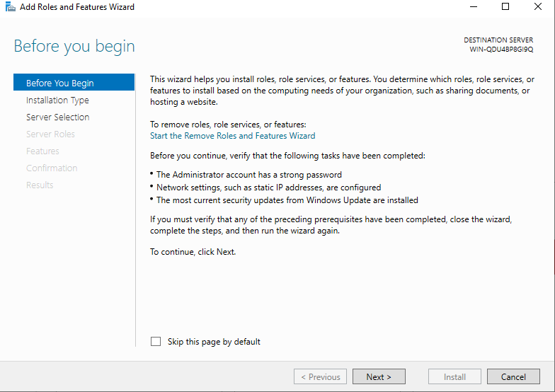
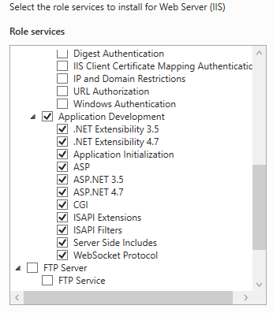

# I Cài đặt IIS
- Ấn vào add roles and features

- Chọn tiếp next

- Chọn vào Web server(IIS)

 
 - Sau khi cài đặt thành công ta chọn close

- Ta khởi động IIS sau khi cải đặt thành công ấn chọn tools rồi chọn theo mũi tên

 
 - được giao diện như sau:
 

- click chuột phải chọn add website

- Điền thông tin

- tạo file index.asp như sau cho file wwwroot  rồi chạy thử 

- xem kết quả:

