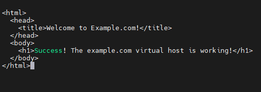
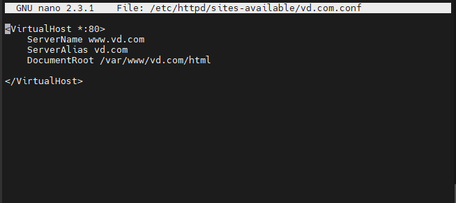
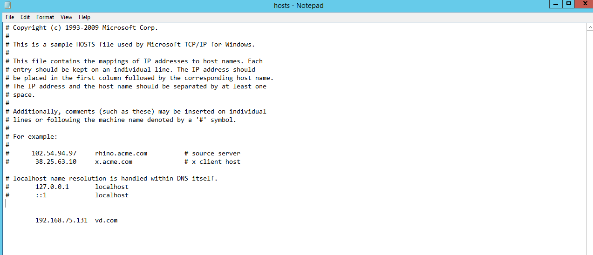
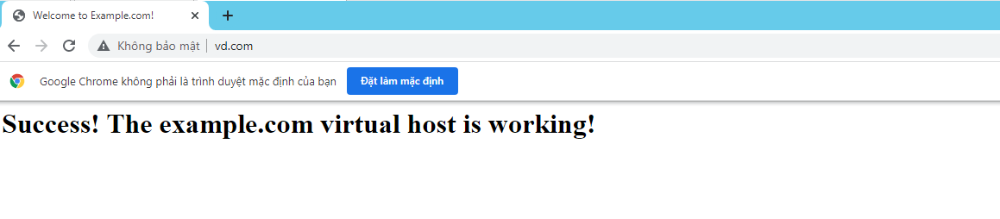
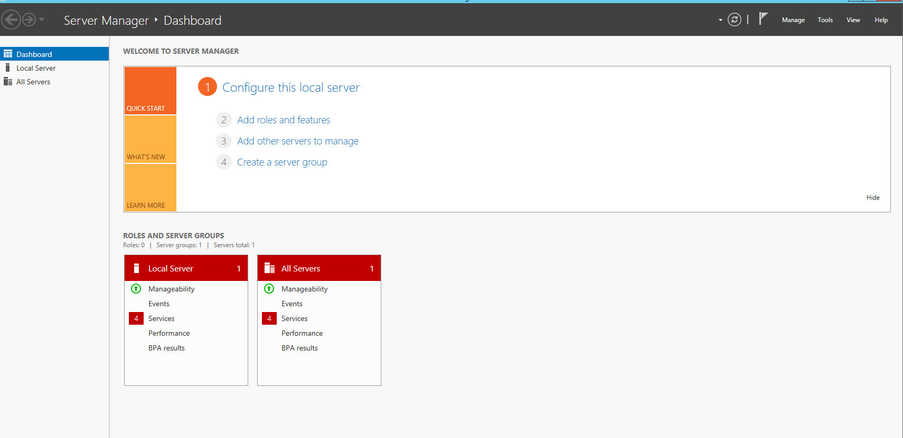
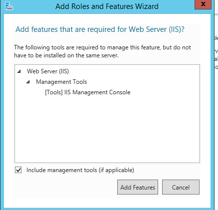
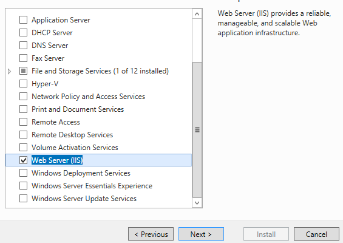
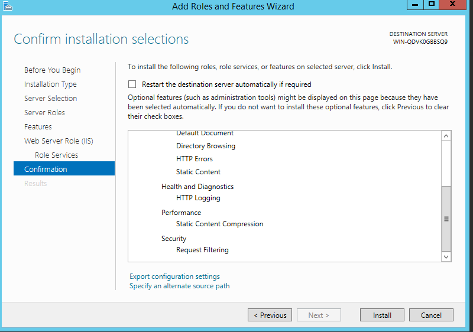
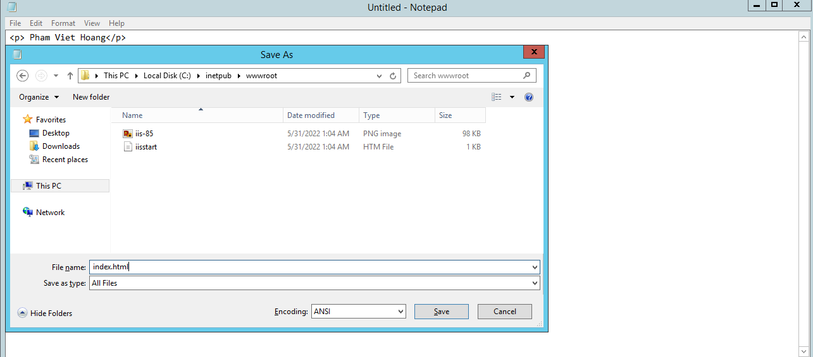
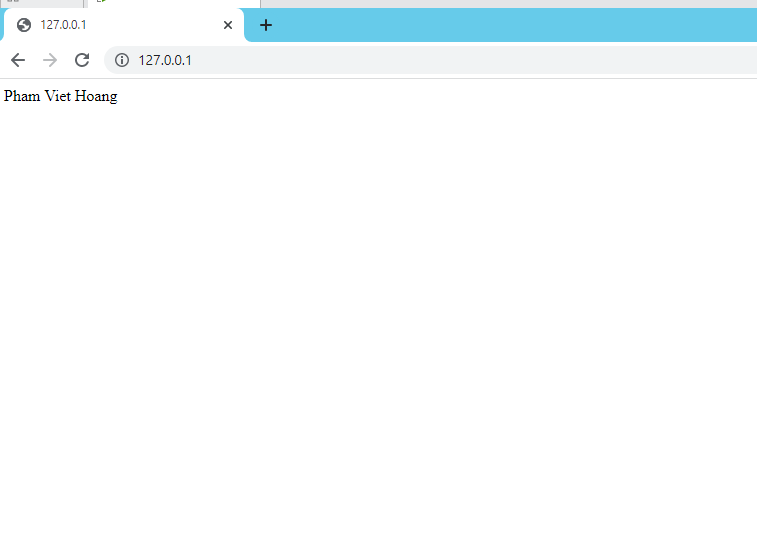

# Webserver 
## I Cài đặt web server Apache trên centos
## 1 Cập nhập phiên bản mới nhất:
 + sudo yum update
## 2 Cài đặt apache bằng câu lệnh:
 + sudo yum install httpd
## 3 Khởi động dịch vụ bằng 2 câu lệnh
 + sudo systemctl enable httpd
 + sudo systemctl start httpd
 ## 4 Cấu hình tường lửa để cho phép truy cập website 
+ firewall-cmd --permanent --zone=public --add-service=http
+ firewall-cmd --permanent --zone=public --add-service=https
+ firewall-cmd --reload
## 5 Cấu hình vhost
+ tạo thư mục để lưu trữ vhost
+ sudo mkdir -p/var/www/html/vd.com/public_html
+ cấp quyền:
+ chown -R apache:apache /var/www/html/vd.com/public_html
+ chmod -R 755 /var/www/html
+ tạo file index.html:
+ sudo nano /var/www/html/vd.com/public_html/index.html

 

+ tạo 2 folder sites-avalable và site-enabled tại /etc/httpd
+ mở file httpd.còn tại /etc/httpd/conf/httpd.conf
+ thêm dòng này ở cuối cùng:
IncludeOptional sites-enabled/*.conf 
+ tạo virtual host cho website:
sudo nano /etc/httpd/sites-available/vd.com.conf

 

+ cấu hình file hosts trên window server để truy cập:
 - Windows/System32/drivers/etc/hosts

 
 
 - Truy cập 

## II Cài đặt web server trên windows server
 + Cài đặt IIS
 - Ở Server Manger , chọn Add Roles

- Ấn next đến mục Server Roles rồi tích chọn mục Web Server(ISS)
- Chọn add features,rồi chọn next

- Chọn next rồi chọn install

- mở notepad chạy dưới quyền admin
- rồi lưu  vào thư mục C:/interput/wwwroot với tên index.html

- Kiểm tra bằng cách vào trình duyệt của máy gõ 127.0.0.1 hoặc localhost.

